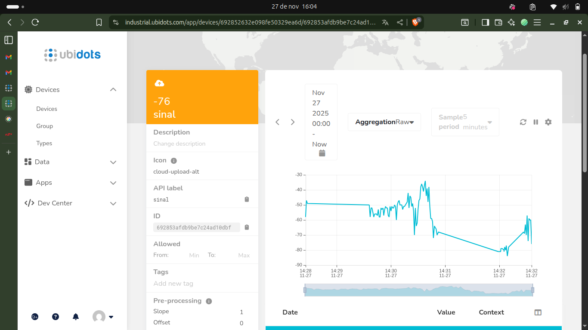

# Envio de Intensidade de Sinal Wi-Fi (RSSI) para o Ubidots via MQTT

## 1. Objetivo da Atividade
Este projeto tem como objetivo desenvolver um sistema embarcado capaz de:

- Conectar-se a uma rede Wi-Fi.
- Medir continuamente a intensidade do sinal recebido (RSSI).
- Enviar esses valores para a plataforma **Ubidots** utilizando o protocolo **MQTT**.
- Exibir e analisar esses dados em um dashboard online.

A atividade demonstra conectividade IoT, aquisição de dados e comunicação com um backend em nuvem.

---

## 2. Materiais Utilizados

| Item | Quantidade | Descrição |
|------|------------|-----------|
| ESP32 | 1 | Microcontrolador com Wi-Fi |
| Cabo USB | 1 | Upload do código e alimentação |
| Arduino IDE | 1 | Ambiente de programação |
| Ubidots | 1 | Dashboard e MQTT |

---

## 3. Funcionamento Geral do Sistema

1. O ESP32 conecta-se ao Wi-Fi definido no código.  

2. Após conectado, tenta autenticar no broker MQTT da Ubidots.

3. A cada 1 segundo, lê o valor de **RSSI** (força do sinal em dBm).  

4. Envia esse valor no formato JSON para o dispositivo criado na plataforma.  

5. O Usuário observa no dashboard a variação do sinal, inclusive nos testes de simulação de blindagem (gaiola de Faraday no elevador do Inteli).

---

## 4. Código usado para o teste

```cpp
#include <WiFi.h>
#include <PubSubClient.h>

const char* WIFI_SSID = "Inteli.Iot";
const char* WIFI_PASS = "...";
const char* UBIDOTS_TOKEN = "...";
const char* DEVICE_LABEL = "teste-wifi";
const char* MQTT_SERVER = "industrial.api.ubidots.com";
const uint16_t MQTT_PORT = 1883;

const unsigned long PUBLISH_INTERVAL_MS = 1000UL;

WiFiClient wifiClient;
PubSubClient mqttClient(wifiClient);

unsigned long lastPublish = 0;

String ubidotsTopic() {
  String t = "/v1.6/devices/";
  t += DEVICE_LABEL;
  return t;
}

void connectWiFi() {
  if (WiFi.status() == WL_CONNECTED) return;

  Serial.printf("Conectando à rede WiFi '%s'...\n", WIFI_SSID);
  WiFi.begin(WIFI_SSID, WIFI_PASS);

  unsigned long start = millis();
  while (WiFi.status() != WL_CONNECTED) {
    delay(500);
    Serial.print(".");
    if (millis() - start > 20000UL) {
      Serial.println("\nTempo esgotado ao conectar WiFi, tentando novamente...");
      start = millis();
      WiFi.begin(WIFI_SSID, WIFI_PASS);
    }
  }
  Serial.println();
  Serial.print("WiFi conectado. IP: ");
  Serial.println(WiFi.localIP());
}

void connectMQTT() {
  if (mqttClient.connected()) return;

  mqttClient.setServer(MQTT_SERVER, MQTT_PORT);

  Serial.print("Conectando ao MQTT (Ubidots)...");
  String clientId = DEVICE_LABEL;
  clientId += "-";
  clientId += String((uint32_t)ESP.getEfuseMac(), HEX);

  if (mqttClient.connect(clientId.c_str(), UBIDOTS_TOKEN, NULL)) {
    Serial.println(" conectado ao MQTT.");
  } else {
    Serial.print(" falha. rc=");
    Serial.print(mqttClient.state());
    Serial.println(" - Retentando em breve...");
  }
}

void setup() {
  Serial.begin(115200);
  delay(100);

  connectWiFi();
  mqttClient.setServer(MQTT_SERVER, MQTT_PORT);

  Serial.println("Setup completo.");
}

void loop() {
  if (WiFi.status() != WL_CONNECTED) {
    connectWiFi();
  }
  if (!mqttClient.connected()) {
    connectMQTT();
  } else {
    mqttClient.loop();
  }

  unsigned long now = millis();
  if (now - lastPublish >= PUBLISH_INTERVAL_MS) {
    lastPublish = now;

    long rssi = WiFi.RSSI();

    Serial.printf("[%lu] RSSI: %ld dBm\n", now, rssi);

    String payload = "{\"sinal\": " + String(rssi) + "}";
    String topic = ubidotsTopic();

    boolean ok = false;
    if (mqttClient.connected()) {
      ok = mqttClient.publish(topic.c_str(), payload.c_str());
    }

    if (ok) {
      Serial.println("Publicado em Ubidots -> " + topic + ": " + payload);
    } else {
      Serial.println("Falha ao publicar. MQTT conectado? " + String(mqttClient.connected()));
    }
  }
  
  delay(10);
}

```

## 5. Explicação do Código

### 5.1 Bibliotecas

```cpp
#include <WiFi.h>
#include <PubSubClient.h>
```
- **WiFi.h:** gerencia a conexão à rede sem fio.

- **PubSubClient.h:** responsável pela comunicação MQTT.

---

## 5.2 Configurações Principais

```cpp
const char* WIFI_SSID = "Inteli.Iot";
const char* WIFI_PASS = "...";
const char* UBIDOTS_TOKEN = "...";
const char* DEVICE_LABEL = "teste-wifi";
```
- Define rede Wi-Fi, credenciais e token MQTT.

- **DEVICE_LABEL** é o nome do dispositivo na Ubidots.

---
## 5.3 Conexão Wi-Fi

O ESP32 tenta conectar e, caso ultrapasse 20 segundos, reinicia a tentativa:

```cpp
WiFi.begin(WIFI_SSID, WIFI_PASS);
```

Indicações aparecem no monitor serial.

---

## 5.4 Conexão MQTT

```cpp
mqttClient.connect(clientId.c_str(), UBIDOTS_TOKEN, NULL);
```

- Usa o token como senha.
- O client ID usa o MAC do ESP32 para garantir unicidade.

---

## 5.5 Publicação do RSSI

```cpp
long rssi = WiFi.RSSI();
String payload = "{\"sinal\": " + String(rssi) + "}";
mqttClient.publish(topic.c_str(), payload.c_str());
```

O payload enviado ao Ubidots é, por exemplo:

```cpp
{"sinal": -55}
```

A publicação ocorre a cada 1 segundo.

---

## 6. Teste no Elevador (Gaiola de Faraday)

Para demonstrar variações bruscas de sinal:

1. Conecte o ESP32 ao Wi-Fi Inteli.Iot.

2. Abra o dashboard com o gráfico de sinal.

3. Entre no elevador com o ESP32 alimentado.

4. Aguarde pelo menos 5 segundos.

5. Saia do elevador.

6. Observe o gráfico mostrando a queda brusca e a recuperação do sinal.

---

## 8. Vídeo Demonstrativo



[[LINK PARA O VÍDEO](https://drive.google.com/file/d/1NDie5dVd5NOd7iowN7tay5LrhvEmpo45/view?usp=sharing)]
